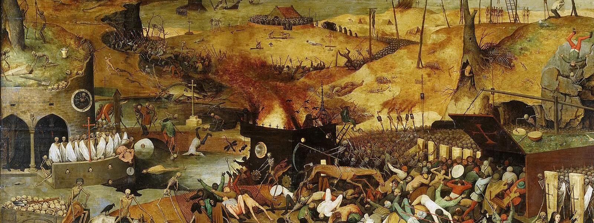

::: {.banner-caption}
Section of The triumph of Death - Pieter Bruegel “the Elder”, Ca. 1562.
:::

## The Economics of Social Conflict:                                       Historical Insights and New Evidence

**Date:** November 26–27, 2026  
**Location:** University of Chile - [Faculty of Economics and Business](https://fen.uchile.cl/en/home/) / Santiago / Chile  

This workshop brings together economic historians, political economists, and applied microeconomists studying the origins, dynamics, and consequences of social conflict, broadly defined — from labor disputes, gender and racial inequality, and struggles over political power, to wars, political violence, and their long-run economic and institutional legacies.

We welcome both historical and contemporary evidence, and are especially interested in work that combines rigorous empirical methods with new data sources to shed light on the political economy of conflict — how struggles over power and resources shape economic and social outcomes, and vice versa. The workshop aims to foster dialogue across economic history, political economy, and applied microeconomics.

## Important dates

<table class="important-dates-table">
  <thead>
    <tr>
      <th>Event</th>
      <th>Date</th>
    </tr>
  </thead>
  <tbody>
    <tr>
      <td>Submission deadline</td>
      <td>15 August 2026</td>
    </tr>
    <tr>
      <td>Notification of acceptance</td>
      <td>30 August 2026</td>
    </tr>
    <tr>
      <td>Confirmation deadline</td>
      <td>20 September 2026</td>
    </tr>
    <tr>
      <td>Workshop dates</td>
      <td>26–27 November 2026</td>
    </tr>
  </tbody>
</table>

## Keynote speakers

- Michela Giorcelli, University of California Los Angeles
- Andy Ferrara, University of Pittsburgh
- Roya Talibova, Harvard University

## Organizers

- [Francisco Pino](https://www.franciscopino.com/Site/Home.html){target="_blank"}, Department of Economics, University of Chile
- [Ariadna Jou](https://www.ariadnajou.com/){target="_blank"}, Department of Economics, University of Chile

## Contact

For questions, please contact:
[few@fen.uchile.cl](mailto:few@fen.uchile.cl)