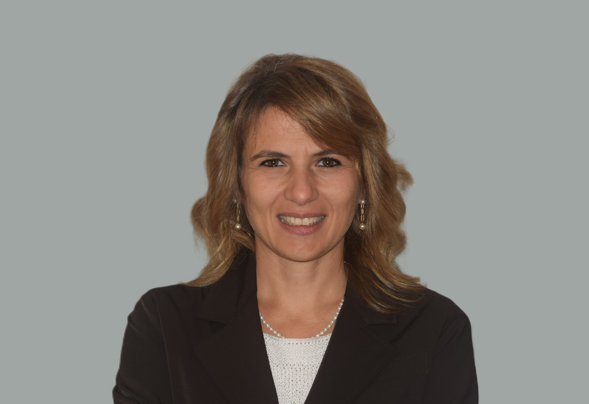
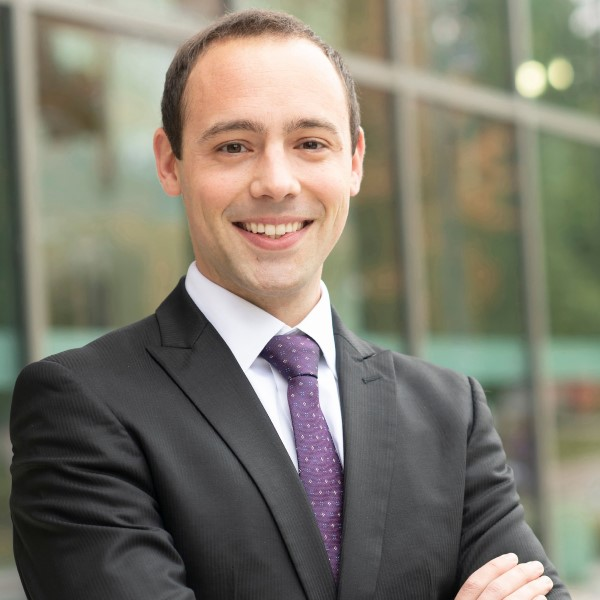
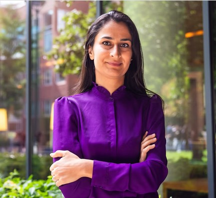

## Keynote speakers

::: {.columns}
::: {.column width="72%"}

### [Michela Giorcelli](http://www.giorcellimichela.com/)

**University of California – Los Angeles**

Michela Giorcelli is a Professor in the Department of Economics at the University of California – Los Angeles. She is also a Faculty Associate at the National Bureau of Economic Research, and a research affiliate at CEPR, CESifo, IZA, J-PAL and CCPR. She serves as an Associate Editor at the Journal of Economic History. She holds a PhD in Economics from Stanford University. She is an economic historian and an applied-micro economist, whose research focuses on the managerial and technological drivers of productivity and innovation in the long run.

:::
::: {.column width="28%"}

{.speaker-photo fig-alt="Michela Giorcelli" width="180px" height="180px"}

:::
:::

::: {.columns}
::: {.column width="72%"}

### [Andy Ferrara](https://andreas-ferrara.com/)

**University of Pittsburgh**

Andy Ferrara is an assistant professor of economics at the University of Pittsburgh. His research lies at the intersection of economic history, labour economics, and political economy with a focus on discrimination, internal and forced migration, and the consequences of violent conflicts, using state-of-the-art data science and causal inference methods.

:::
::: {.column width="28%"}

{.speaker-photo fig-alt="Andy Ferrara" width="180px" height="180px"}

:::
:::

::: {.columns}
::: {.column width="72%"}

### [Roya Talibova](https://www.royatalibova.com/)

**Harvard University**

Roya Talibova is the Sultan Qaboos bin Said of Oman Assistant Professor of Public Policy at John F. Kennedy School of Government at Harvard University. Her research and teaching focus on political violence and its long-run effects on political economy and development, historical political economy, and quantitative methods. Talibova studies combat motivation in authoritarian regimes and the ways in which repression and ethnic identity interact with individual and group combat experiences.

:::
::: {.column width="28%"}

{.speaker-photo fig-alt="Roya Talibova" width="180px" height="180px"}

:::
:::

## Presenters

The full list of presenters will be announced after the acceptance decisions.